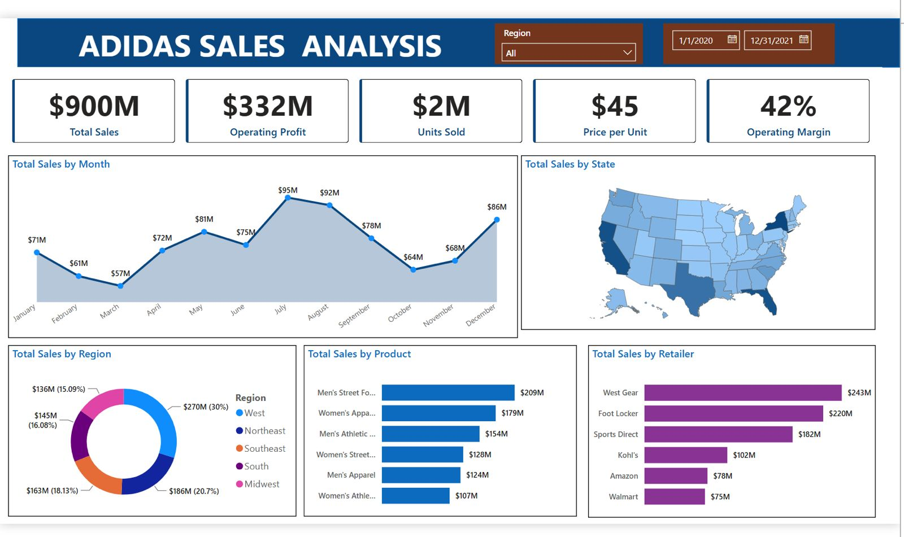

# 👟 Adidas Sales Analysis Dashboard (Power BI)

## 📌 Project Overview

This project presents an interactive Power BI dashboard built using Adidas sales data. It provides insights into sales performance, profit, regional trends, product categories, retailers, and customer purchasing behavior.

The dashboard helps business stakeholders analyze key performance indicators (KPIs) and make data-driven decisions.

## 🎯 Objectives

- Analyze total sales and profit
- Compare sales across different regions
- Identify top-performing products
- Evaluate retailer performance
- Monitor monthly sales trends
- Understand sales by product category

## 🛠 Tools Used

- Power BI Desktop
- Microsoft Excel / CSV
- Power Query
- DAX
- Data Modeling

## 📊 Dashboard Features

- KPI Cards
  - Total Sales
  - Total Profit
  - Units Sold
  - Average Sales

- Interactive Filters
  - Region
  - Product
  - Retailer
  - Year

- Charts
  - Sales by Region
  - Profit by Region
  - Monthly Sales Trend
  - Product Category Analysis
  - Retailer Performance
  - Top Selling Products

## 📈 Business Insights

- Identify the highest revenue-generating regions.
- Discover top-selling Adidas products.
- Analyze retailer performance.
- Compare profits across different regions.
- Track sales trends over time.

## 🚀 How to Use

1. Clone the repository.
2. Open **Adidas sale analysis.pbix** in Power BI Desktop.
3. Refresh the data if required.
4. Explore the interactive dashboard.

## 📷 Dashboard Preview

## ⭐ Skills Demonstrated

- Data Cleaning
- Data Transformation
- Data Modeling
- DAX Measures
- Data Visualization
- Business Intelligence
- Dashboard Design
- Interactive Reporting

## 👨‍💻 Author

**Lohith Chowdary**

Aspiring Data Analyst

Skills:
- Excel
- SQL
- Power BI
- Tableau
- Python 

If you found this project useful, don't forget to ⭐ the repository.
